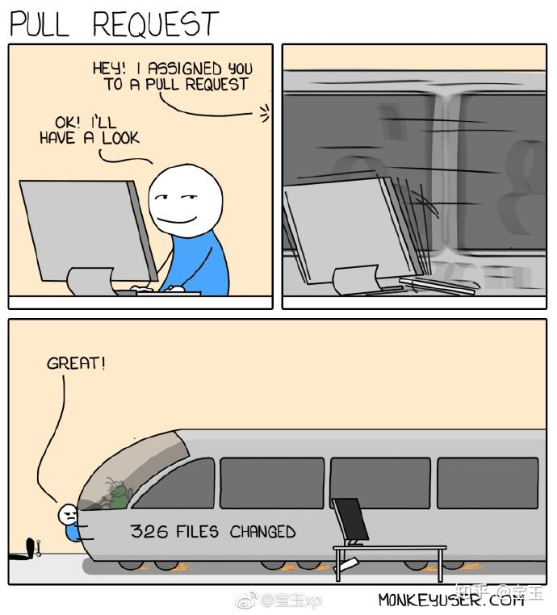

# Code Review
- version: 0.0.1

# Description 说明
## 1. 评论分级
在做 Code Review 时，需要针对审查出有问题的代码行添加评论，如果只是评论，有时候对于被审查者比较难甄别评论所代表的含义，是不是必须要修改。

建议可以对Review的评论进行分级，不同级别的结果可以打上不同的Tag，比如说：

- `[blocker]`: 在评论前面加上一个 `[blocker]` 标记，表示这个代码行的问题必须要修改
- `[optional]`：在评论前面加上一个 `[optional]` 标记，表示这个代码行的问题可改可不改
- `[question]`：在评论前面加上一个 `[question]` 标记，表示对这个代码行不理解，有问题需要问，被审查者需要针对问题进行回复澄清

# References
- [Code Review 最佳实践](https://zhuanlan.zhihu.com/p/73809355)
